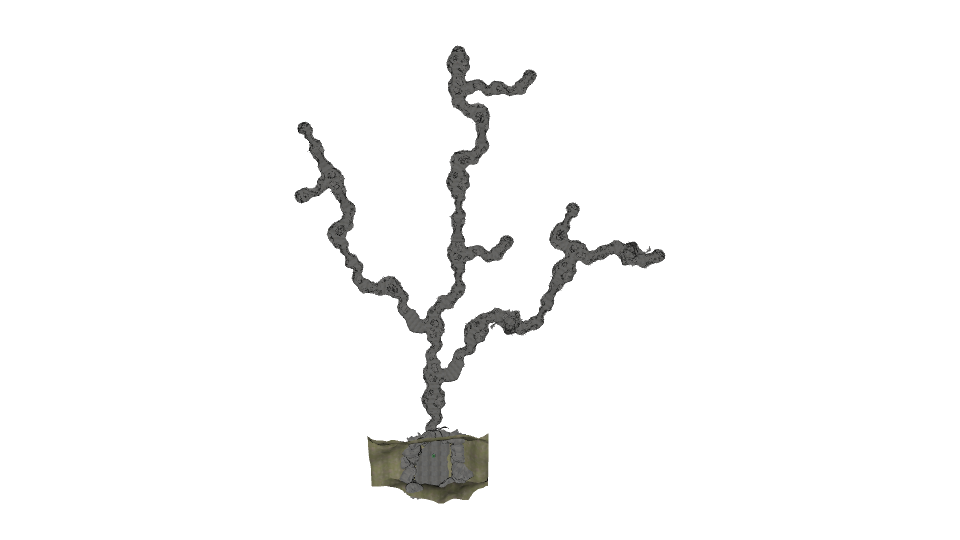
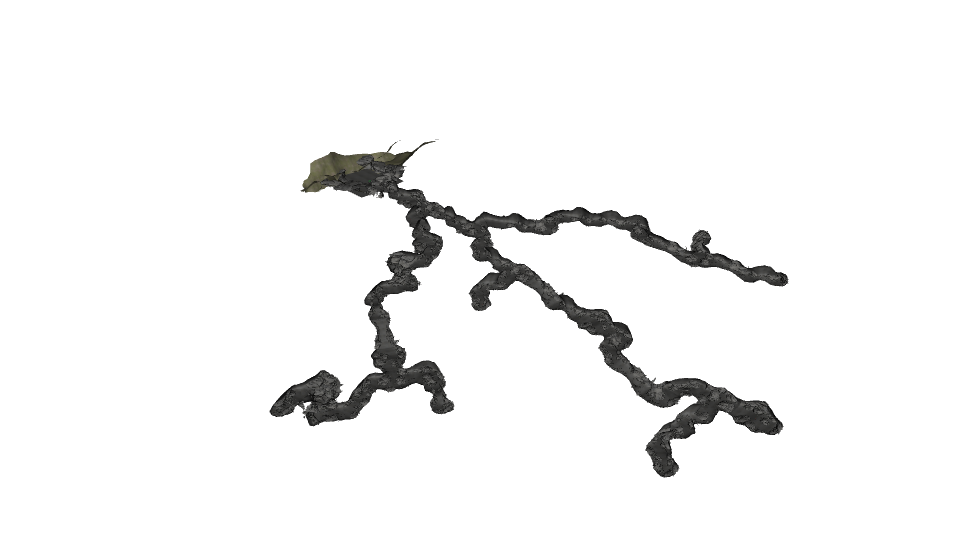
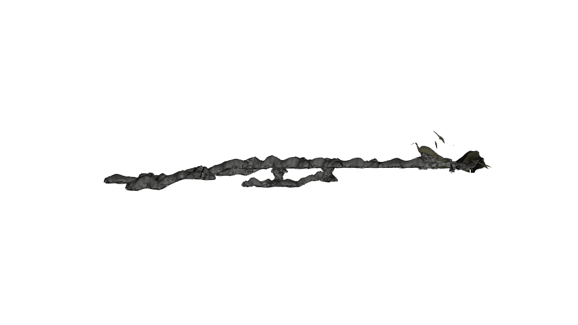

# Energy Aware Active Exploration of Caves Using a Drone

This package owns the integrated cave simulation workflow for:

- Gazebo world: `cave_simple_03`
- PX4 model: `gz_x500_depth_modify`
- PX4 airframe: `4022_gz_x500_depth_modify`
- ROS external-vision bridge: `ros_odom_to_px4_odom`
- RTAB-Map frame contract: `OakD-Lite-Modify/base_link`

The supported path is one launch file:

```bash
ros2 launch cave_exploration cave.launch.py
```

Do not launch `launch/rtabmap.launch.py` separately when using the integrated cave flow. `cave.launch.py` already starts Gazebo, PX4, the ROS/Gazebo bridges, `rtabmap_rgbd_odometry`, `rtabmap`, `rtabmap_viz`, and the ROS-to-PX4 visual odometry bridge.

## What Changed

The current integrated launch is locked to the modified Oak-D camera model and GNSS-denied external-vision flight:

- RTAB-Map now uses `frame_id=OakD-Lite-Modify/base_link` to match the live RGB, depth, and `camera_info` topics.
- The static transform `base_link -> OakD-Lite-Modify/base_link` stays in place because the IMU is still on `base_link`.
- The launch no longer passes `initial_pose` into RTAB-Map, which avoids the ROS parameter serialization failure that crashed `rgbd_odometry`.
- The integrated launch defaults to `sys_autostart:=4022`.
- Airframe `4022_gz_x500_depth_modify` now sets PX4 defaults for GNSS-denied external-vision flight:
  - `EKF2_GPS_CTRL=0`
  - `EKF2_EV_CTRL=15`
  - `EKF2_HGT_REF=3`
  - `EKF2_MAG_TYPE=5`
  - `COM_ARM_WO_GPS=1`
  - `COM_DL_LOSS_T=10`
  - `NAV_DLL_ACT=0`
  - `SYS_HAS_MAG=0`

## Reproducible Setup

### 1. Prerequisites

Assumptions:

- ROS 2 workspace root: `/home/ibraheem/ros2_ws`
- PX4 checkout: `$HOME/PX4-Autopilot`
- `rtabmap_ros`, `ros_gz_bridge`, and PX4 ROS dependencies are installed in the environment you build from

### 2. Sync the PX4-side assets

This package contains the custom airframe, Gazebo model, Oak-D model, and cave world. Copy them into PX4 before building or launching:

```bash
cd /home/ibraheem/ros2_ws/src/cave_exploration
bash scripts/deploy_px4_model_modify.sh
bash scripts/copy_world_file.sh
```

If PX4 lives somewhere else:

```bash
cd /home/ibraheem/ros2_ws/src/cave_exploration
bash scripts/deploy_px4_model_modify.sh --px4-dir /path/to/PX4-Autopilot
bash scripts/copy_world_file.sh --px4-dir /path/to/PX4-Autopilot
```

### 3. Rebuild PX4 and the ROS workspace

```bash
cd $HOME/PX4-Autopilot
make px4_sitl gz_x500_depth_modify

cd /home/ibraheem/ros2_ws
colcon build --packages-select cave_exploration
source install/setup.bash
```

The first `make px4_sitl gz_x500_depth_modify` rebuild is important after updating the custom airframe or Gazebo model files copied into PX4.

## Launch

From the ROS workspace:

```bash
cd /home/ibraheem/ros2_ws
source install/setup.bash
ros2 launch cave_exploration cave.launch.py
```

Useful overrides:

```bash
ros2 launch cave_exploration cave.launch.py gazebo_startup_delay:=25.0
ros2 launch cave_exploration cave.launch.py model_pose:=0,0,2,0,0,0
ros2 launch cave_exploration cave.launch.py px4_dir:=/path/to/PX4-Autopilot
```

The launch already performs stale-process cleanup before starting Gazebo and PX4. That cleanup plus the default `gazebo_startup_delay:=20.0` is the intended deterministic startup path.

## Runtime Validation

### ROS node health

```bash
ros2 node list | grep rtabmap
```

Expected nodes:

- `rtabmap_rgbd_odometry`
- `rtabmap`
- `rtabmap_viz`
- `rtabmap_odom_to_px4`

### RTAB-Map odometry output

```bash
ros2 topic info /rtabmap/odom
ros2 topic echo --once /rtabmap/odom
```

### Frame consistency

Check the sensor topic frame IDs:

```bash
ros2 topic echo --once /drone/front_rgb/header
ros2 topic echo --once /drone/front_depth/header
ros2 topic echo --once /drone/camera_info/header
```

These should report:

```text
frame_id: OakD-Lite-Modify/base_link
```

Check the static transform:

```bash
ros2 topic echo --once /tf_static
```

You should see the `base_link -> OakD-Lite-Modify/base_link` transform published by `camera_link_static_tf`.

Check that RTAB-Map is producing the dynamic odometry tree:

```bash
ros2 topic echo --once /tf
```

### PX4 external-vision ingestion

In the PX4 shell:

```text
listener vehicle_visual_odometry 1
listener estimator_status_flags 1
listener vehicle_local_position 1
```

Use these checks to separate the two common blockers:

- `vehicle_visual_odometry`: confirms PX4 is receiving the RTAB-Map external-vision feed.
- `estimator_status_flags`: confirms whether EV fusion is healthy and whether heading is still being rejected.
- `vehicle_local_position`: confirms whether local `xy/z` and heading are actually valid for control.

If `vehicle_visual_odometry` is live but `vehicle_local_position` is still invalid, fix the EV/local-position path first. If local position is valid and heading is still blocked by compass expectations, the cave airframe now removes that dependency with `EKF2_MAG_TYPE=5` and `SYS_HAS_MAG=0`.

## Minimal Offboard Scaffold

This package also installs a minimal future exploration node:

```bash
ros2 run cave_exploration exploration_offboard
```

What it does in this slice:

- subscribes to `/fmu/out/vehicle_status`
- subscribes to `/fmu/out/vehicle_local_position`
- publishes `/fmu/in/offboard_control_mode`
- publishes `/fmu/in/trajectory_setpoint`
- publishes `/fmu/in/vehicle_command`

By default it only publishes the offboard heartbeat and a simple position setpoint scaffold. To let it issue the offboard/arm commands automatically once it has sent enough heartbeats, run:

```bash
ros2 run cave_exploration exploration_offboard --ros-args -p auto_engage:=true
```

This node is intentionally not launched by `cave.launch.py` yet so estimator debugging and autonomy work stay separate.

## Troubleshooting

- If PX4 does not spawn reliably, rerun the integrated launch instead of manually stacking extra Gazebo or PX4 processes. The launch is designed to own cleanup and startup order.
- If `ros2 node list` shows the RTAB-Map nodes but `/rtabmap/odom` does not publish, treat that as an RTAB-Map odometry initialization problem first, not a PX4 parameter problem.
- If `tf2_echo` or `/tf` suggests disconnected trees, verify `/rtabmap/odom` is publishing before changing more TF parameters.
- If the sensor topics do not use `OakD-Lite-Modify/base_link`, the Gazebo-side model copy in PX4 is likely stale. Re-run the deploy scripts and rebuild PX4.

## Cave World Preview

## Darpa Sub-T cave simple 3





